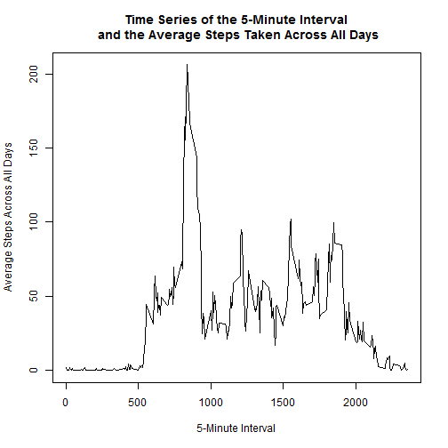
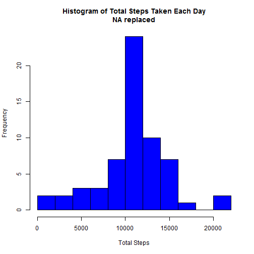

# Reproducible Research: Peer Assessment 1

## Loading and preprocessing the data

####1. First we need to read .csv file. Must set the working directory to the correct folder


```r
library(lattice)
library(knitr)
setwd("C:/Users/Admin/Documents/RDS/M5/peerAsg1")
dfactivity<-read.csv("activity.csv")
```

## What is mean total number of steps taken per day?

####1. We total up all the steps for each date, change the column name, and check the first 10 lines of the total data frame totaldf


```r
## (total number of (steps taken per day))
totaldf <- aggregate(steps ~ date, dfactivity, sum, na.rm=TRUE)

## add descriptive variable names
names(totaldf)[2] <- "sum_steps"

## check out new data frame
head(totaldf, 5)
```

```
##         date sum_steps
## 1 10/10/2012      9900
## 2 10/11/2012     10304
## 3 10/12/2012     17382
## 4 10/13/2012     12426
## 5 10/14/2012     15098
```

####2. Now let's see the histogram plot

The`echo = FALSE` parameter was added to the code chunk to prevent printing of the R code that generated the plot.

 

####3. Calculate and report the mean and median of the total number of steps taken per day

```r
mean(totaldf$sum_steps)
```

```
## [1] 10766.19
```

```r
median(totaldf$sum_steps)
```

```
## [1] 10765
```

## What is the average daily activity pattern?

####1. Make time series plot of the 5-minute interval (x-axis) and the average number of steps taken, averaged across all days (y-axis)


```r
## the average number of steps taken, averaged across all days for each 5-minute interval
intervaldfna <- aggregate(steps ~ interval, dfactivity, mean, na.rm=TRUE)
head(intervaldfna)
```

```
##   interval     steps
## 1        0 1.7169811
## 2        5 0.3396226
## 3       10 0.1320755
## 4       15 0.1509434
## 5       20 0.0754717
## 6       25 2.0943396
```

```r
## plot time series
plot(
  x = intervaldfna$interval,
  y = intervaldfna$steps,
  type = "l",
  main = "Time Series of the 5-Minute Interval\n and the Average Steps Taken Across All Days",
  xlab = "5-Minute Interval",
  ylab = "Average Steps Across All Days"
)
```

 

####2. Which 5-minute interval, on average across all the days in the dataset, contains the maximum number of steps?


```r
# Use the max() function to find the maximum number of steps
intervaldfna[intervaldfna$steps==max(intervaldfna$steps),]
```

```
##     interval    steps
## 104      835 206.1698
```

## Imputing missing values

####1. Calculate and report the total number of missing values in the dataset (i.e. the total number of rows with NAs)


```r
#Check how mana NA in data frame
allNA<-is.na(dfactivity)
sumNA<-sum(allNA)
sumNA
```

```
## [1] 2304
```

####2. Devise strategy and 3. Create new dataset with replaces NAs


```r
#copy to data frame, replace all NA with the mean of the steps
dfactivity.averages <- aggregate(x=list(steps=dfactivity$steps), by=list(interval=dfactivity$interval), FUN=mean, na.rm=TRUE)
df.missing <- is.na(dfactivity$steps)
table(df.missing)
```

```
## df.missing
## FALSE  TRUE 
## 15264  2304
```

```r
#fill in the NAs
nafiller <- function(steps, interval){
  filler <- NA
  if (!is.na(steps))
    filler <- c(steps)
  else
    filler <- (dfactivity.averages[dfactivity.averages$interval==interval, "steps"])
  return(filler)
}
#replace all NA with the mean of the steps
myfill.df <- dfactivity
myfill.df$steps <- mapply(nafiller, myfill.df$steps, myfill.df$interval)

#check the new data frame and check how many NAs. Should be 0 NAs
head(myfill.df)
```

```
##       steps      date interval
## 1 1.7169811 10/1/2012        0
## 2 0.3396226 10/1/2012        5
## 3 0.1320755 10/1/2012       10
## 4 0.1509434 10/1/2012       15
## 5 0.0754717 10/1/2012       20
## 6 2.0943396 10/1/2012       25
```

```r
sum(is.na(myfill.df))
```

```
## [1] 0
```

```r
df2.missing <- is.na(myfill.df$steps)
table(df2.missing)
```

```
## df2.missing
## FALSE 
## 17568
```

```r
totalmyfill <- aggregate(steps ~ date, myfill.df, sum)
head(totalmyfill)
```

```
##         date    steps
## 1  10/1/2012 10766.19
## 2 10/10/2012  9900.00
## 3 10/11/2012 10304.00
## 4 10/12/2012 17382.00
## 5 10/13/2012 12426.00
## 6 10/14/2012 15098.00
```

####4. Plot the histogram and calculate mean and median


```r
#plot histogram
hist(
  totalmyfill$steps,
  col = "blue",
  main = "Histogram of Total Steps Taken Each Day\nNA replaced",
  xlab = "Total Steps",
  breaks = 15
)
```

 

```r
mean(totalmyfill$steps)
```

```
## [1] 10766.19
```

```r
median(totalmyfill$steps)
```

```
## [1] 10766.19
```
The values of mean and median after we replaced the NAs with average value remains the same. This indicates that the strategy to fill up NAs with average value is acceptable strategy

## Are there differences in activity patterns between weekdays and weekends?


```r
###DATE and DAY
dayType <- function(day){
  if (day %in% c("Monday", "Tuesday", "Wednesday", "Thursday", "Friday"))
    return("Weekday")
  else if (day %in% c("Saturday", "Sunday"))
    return("Weekend")
  }  
head(myfill.df)
```

```
##       steps      date interval
## 1 1.7169811 10/1/2012        0
## 2 0.3396226 10/1/2012        5
## 3 0.1320755 10/1/2012       10
## 4 0.1509434 10/1/2012       15
## 5 0.0754717 10/1/2012       20
## 6 2.0943396 10/1/2012       25
```

```r
fillDate.df <-myfill.df
head(fillDate.df)
```

```
##       steps      date interval
## 1 1.7169811 10/1/2012        0
## 2 0.3396226 10/1/2012        5
## 3 0.1320755 10/1/2012       10
## 4 0.1509434 10/1/2012       15
## 5 0.0754717 10/1/2012       20
## 6 2.0943396 10/1/2012       25
```

```r
fillDate.df$day <-weekdays(as.Date(fillDate.df$date))
fillDate.df$daytype <- sapply(fillDate.df$day, FUN=dayType)
head(fillDate.df)
```

```
##       steps      date interval       day daytype
## 1 1.7169811 10/1/2012        0 Wednesday Weekday
## 2 0.3396226 10/1/2012        5 Wednesday Weekday
## 3 0.1320755 10/1/2012       10 Wednesday Weekday
## 4 0.1509434 10/1/2012       15 Wednesday Weekday
## 5 0.0754717 10/1/2012       20 Wednesday Weekday
## 6 2.0943396 10/1/2012       25 Wednesday Weekday
```

#### I have problem when calculating mean for each dayType
